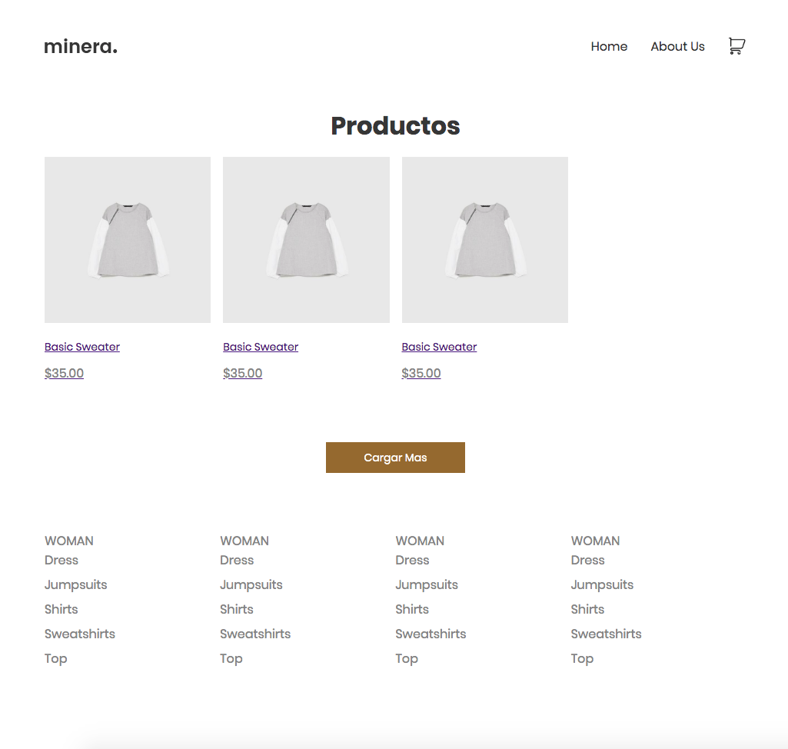

# Realizar maqueta de una tienda virtual con las siguientes vistas:

1. Listado en cuadrículas de los productos.
2. Ventana modal con descripción de cada producto, precio y opción de agregar al carrito de compras.
3. Vista de carrito de compras y valor total de la compra.

Requerimientos técnicos: 

- Debe implementar CSS Grid (opcional usar flex de manera adicional)
- Opcional usar preprocesador (no permitido usar framework, sólo CSS puro),
- HTML considerando prácticas básicas de accesibilidad
- Puede implementar animaciones en CSS y actividades con Js Vanilla (no extensiones ni librerías externas).

## Motivación

Practicar los conocientos aprendidos en el curso de CSS Grid.

## Screenshot

  

## Tech/framework used

<b>Built with</b>

- HTML
- CSS
- CSS Grid areas
- CSS Grid template
- BEM
- CSS variables
- rem y em 

